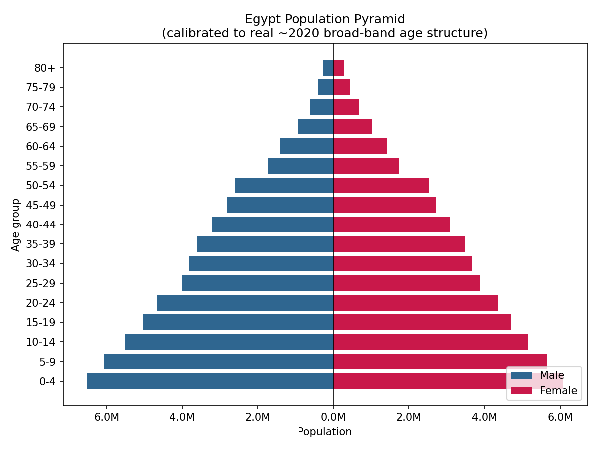
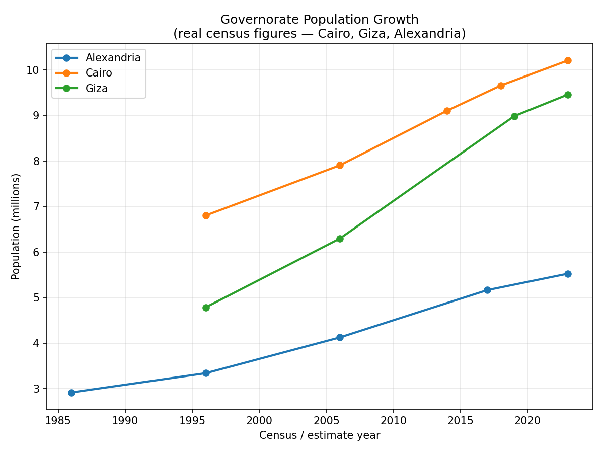

# Egypt Population/Demographics Visualizer

An age pyramid and a governorate population-growth chart, built from real
published Egyptian demographic statistics rather than invented numbers —
Cairo is home, so this is the country's own data.

Real charts, generated by `analyze.py` from the dataset in this repo:





## Features

- **Age pyramid**: real broad age-band population counts by sex (0-14,
  15-24, 25-54, 55-64, 65+, ~2020) split into standard 5-year bins for the
  classic pyramid shape — the split is calibrated so the bins in each band
  sum EXACTLY back to the real sourced total (verified in tests), even
  though the fine 5-year breakdown itself is illustrative rather than
  independently sourced (Egypt's true 5-year-by-sex table is only published
  as an interactive chart, not as data)
- **Regional growth**: real census/estimate populations for Cairo, Giza,
  and Alexandria across their actual recorded years (irregular intervals,
  not evenly spaced) — showing Giza's population nearly doubling since 1996
  while Cairo's growth has visibly slowed in the most recent period
- Both datasets are exposed as tidy `pandas` DataFrames
  (`age_pyramid_dataframe`, `regional_growth_dataframe`) alongside the
  plain-Python helper functions
- CAGR (compound annual growth rate) computed per region, both over the
  full recorded span and for just the most recent period — the more
  telling number, since a governorate's overall average can hide a growth
  rate that's already slowing down

## Tech Stack

Python 3 · pandas · matplotlib

## Getting Started

```bash
git clone https://github.com/Kazenubis/egypt-demographics-visualizer.git
cd egypt-demographics-visualizer
pip install -r requirements.txt
python3 analyze.py
```

Run the tests:

```bash
python3 -m unittest test_demographics_data.py -v
```

## Data Sources

- Broad-band age structure (~2020, male/female counts): [IndexMundi — Egypt
  age structure](https://www.indexmundi.com/egypt/age_structure.html)
- Governorate census populations (Cairo, Giza, Alexandria, multiple
  years): Wikipedia governorate pages
  ([Cairo](https://en.wikipedia.org/wiki/Cairo_Governorate),
  [Giza](https://en.wikipedia.org/wiki/Giza_Governorate),
  [Alexandria](https://en.wikipedia.org/wiki/Alexandria_Governorate)),
  citing Egypt's CAPMAS census data
- Cross-checked against [Worldometer](https://www.worldometers.info/demographics/egypt-demographics/)
  and [PopulationPyramid.net](https://www.populationpyramid.net/egypt/2023/)
  for total population and median age

## What I Learned

The three sources I cross-checked against each other don't perfectly
agree — IndexMundi's age-band data is from around 2020, the governorate
census points span 1986-2023, and Worldometer's 2026 projection and
PopulationPyramid.net's 2023 snapshot use their own estimation
methodologies. Total population reported ranges from about 104M
(reconstructed from the IndexMundi age bands) up to 120M (Worldometer's
2026 projection). Rather than silently picking whichever number looked
best, I kept the sources explicit and separate by year/purpose, and added
a sanity-range test (`total_population` should land somewhere in
90-130M) instead of asserting one exact figure — because for real-world
data from multiple independent sources, "roughly consistent" is the
honest bar, not "identical."

The more interesting technical piece was making sure the illustrative fine
split didn't quietly drift from the real numbers: `build_age_pyramid()`
splits each sourced broad band into 5-year bins, and
`broad_band_totals_from_pyramid()` re-aggregates them back up — the test
asserts that round-trip reproduces the *original* sourced figures exactly.
That test would have caught any place a rounding choice or a typo in the
split weights silently invented or dropped population that wasn't actually
in the source data.
